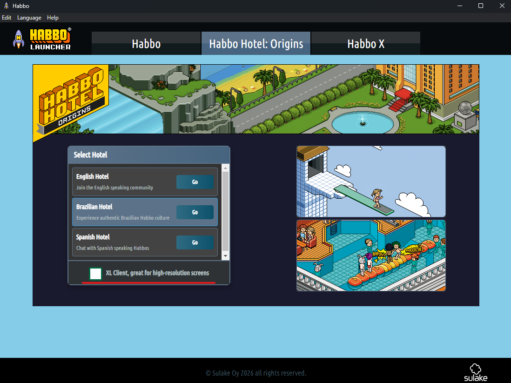
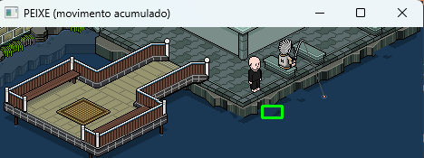

# 🎣 HabboOriginsFishBot

Bot de autopesca para o Jardim Flutuante do Habbo Hotel: Origins utilizando visão computacional com OpenCV.

## 📋 Descrição

Este bot automatiza o processo de pesca no Habbo Origins, detectando peixes através da análise de movimento na água e respondendo automaticamente ao balão de pesca. Utiliza técnicas de Computer Vision para identificar:
- Movimento de peixes na área da água (através de máscaras HSV)
- Balão de pesca (template matching)
- Estados do jogo (procurando, movendo, esperando, pescando)

## ✨ Features

- ✅ Detecção automática de peixes usando análise de movimento acumulado
- ✅ Reconhecimento do balão de pesca por template matching
- ✅ Máquina de estados para gerenciar o ciclo completo de pesca
- ✅ Modo debug visual (F1) para acompanhar a detecção em tempo real
- ✅ Sistema de timeout e recuperação automática de falhas
- ✅ Captura otimizada de tela com MSS
- ✅ Integração com janela do cliente Habbo

## 🛠️ Tecnologias Utilizadas

- **Python 3.x**
- **OpenCV** - Processamento de imagem e detecção
- **NumPy** - Operações numéricas e matriciais
- **PyAutoGUI** - Automação de mouse
- **MSS** - Captura rápida de tela
- **Keyboard** - Hotkeys para controle
- **PyWin32** - Manipulação de janelas do Windows
- **PyGetWindow** - Listagem de janelas

## 📦 Instalação

1. Clone o repositório:
```bash
git clone https://github.com/seu-usuario/HabboOriginsFishBot.git
cd HabboOriginsFishBot
```

2. Instale as dependências:
```bash
pip install -r requirements.txt
```

## 🎮 Como Usar

### 1️⃣ Configure o Cliente Habbo Origins

Abra o cliente do Habbo Origins **sem marcar a opção "XL"**. É importante que a janela esteja no tamanho padrão para que as coordenadas funcionem corretamente.



### 2️⃣ Posicione-se no Jardim Flutuante

- Entre no Jardim Flutuante do Habbo Origins
- Posicione seu personagem próximo ao lago de pesca
- Certifique-se de que a área do lago está visível na tela

### 3️⃣ Execute o Bot

```bash
python fishing_bot.py
```


> ⚠️ **Aviso:** A janela do jogo não pode ser minimizada durante a pesca!

### 4️⃣ Modo Debug (Opcional)

Pressione **F1** para ativar/desativar o modo debug. No modo debug, você verá:
- Estado atual do bot (SEARCHING, MOVING, WAITING_BITE, FISHING)
- Detecção de peixes em tempo real (círculos verdes)
- Detecção do balão de pesca
- Visualização do processamento de imagem



*A imagem acima mostra como o OpenCV detecta os peixes através da análise de movimento na área da água.*

## 🔧 Arquivos Auxiliares

O projeto inclui scripts de debug e calibração:

- `debug_fish.py` - Testa a detecção de peixes
- `debug_balloon.py` - Testa a detecção do balão
- `debug_water.py` - Testa a máscara de água
- `debug_roi.py` - Visualiza a região de interesse
- `calibrate_x.py` / `calibrate_y.py` - Calibração de coordenadas
- `get_mouse_pos.py` - Obtém posição do mouse
- `list_windows.py` - Lista janelas abertas

## ⚙️ Como Funciona

### Estados do Bot

1. **SEARCHING** - Procura por peixes usando análise de movimento
2. **MOVING** - Aguarda o personagem se mover até o local do peixe
3. **WAITING_BITE** - Espera o peixe morder a isca
4. **FISHING** - Pesca em andamento, monitora o balão

### Detecção de Peixes

O bot utiliza:
- Conversão para HSV e máscara de água (tons de azul/ciano)
- Diferença entre frames consecutivos para detectar movimento
- Acumulação de movimento em 6 frames
- Filtragem por área de contorno (120-2000 pixels)

### Timeouts

- 20s sem encontrar peixe → reinicia busca
- 10s após primeiro clique → segundo clique
- 25s esperando mordida → reinicia ciclo

## 📄 Licença

Este projeto está sob a licença MIT. Veja o arquivo [LICENSE](LICENSE) para mais detalhes.

## ⚠️ Aviso

Este bot é apenas para fins educacionais. O uso de bots pode violar os termos de serviço do Habbo Hotel. Use por sua conta e risco.

---

## Créditos

 - MrCR - Desenvolvedor entusiasta
 - cori01 - Apareceu no print :D

**Desenvolvido com ❤️ para a comunidade Habbo Origins**
